# PoCket — 테스트베드 실증 매칭 플랫폼

> The following practice code is intended for educational purposes only.
> For contact: audit@korea.ac.kr, Sungryel Lim Ph.D
>
> This practice code is not a completed commercial version but has been developed for
> educational purposes; supplementation is required depending on the deployment objective
> for use as a commercial service.

실증(PoC) 공간을 가진 사업장과, 제품을 현장에서 검증해야 하는 스타트업을 연결하는 매칭 플랫폼입니다.
수업에서 제공된 온라인 교육 플랫폼 템플릿의 개념 구조를 그대로 두고 화면의 언어만 실증 도메인으로
치환한 뒤, 템플릿에 없는 상호 평가 기능을 독립 서비스로 추가했습니다.

**제공된 5개 서비스와 인프라는 이미지 그대로 실행하며 백엔드 코드는 수정하지 않습니다.**

---

## 목차

1. [팀 구성과 역할](#팀-구성과-역할)
2. [도메인 치환](#도메인-치환)
3. [시스템 구성](#시스템-구성)
4. [다이어그램](#다이어그램)
5. [빠른 시작](#빠른-시작)
6. [프론트엔드 실행](#프론트엔드-실행)
7. [더미 데이터 적재](#더미-데이터-적재)
8. [화면 구성](#화면-구성)
9. [동작 과정](#동작-과정)
10. [review-service API](#review-service-api)
11. [개발 규칙](#개발-규칙)
12. [운영 명령 모음](#운영-명령-모음)
13. [트러블슈팅](#트러블슈팅)
14. [알려진 제약](#알려진-제약)
15. [브랜치와 문서](#브랜치와-문서)

---

## 팀 구성과 역할

판교 6반 1조. Agile 방법론에 따라 역할을 나누고, 기능 단위로 브랜치를 쪼개 병렬로 진행합니다.

| 역할 | 담당 | 하는 일 |
|---|---|---|
| Product Owner | 이민기 | 백로그 우선순위 결정, 도메인 정의, 스프린트 범위 확정 |
| Scrum Master | 노윤성 | 스프린트 운영, 병합 시점 조율, 진행 장애물 제거 |
| Frontend Dev | 노윤성, 이효은 | 화면 전체, 도메인 라벨 치환, 디자인 시스템 |
| Backend Dev | 이도권, 이민기, 이산 | review-service 신규 개발, 인프라 기동, API 명세 |

역할이 겹치는 인원이 있는 것은 팀 규모상 자연스러운 일이며, 릴리스 단위를 하나로 묶지 않고
서비스별로 독립 배포하기 때문에 가능한 구성입니다.

### 일하는 방식

- **작게 나눠 자주 병합한다.** 백엔드와 프론트엔드가 각자 브랜치에서 진행하고, 동작하는 단위가
  나올 때마다 `main` 에 병합합니다.
- **제공된 백엔드는 고치지 않는다.** 제약을 받아들이고 우회로를 찾는 쪽을 택했습니다.
  이 원칙 덕분에 다른 팀원의 작업이 내 변경으로 깨지지 않습니다.
- **못 만든 것은 숨기지 않고 기록한다.** 범위를 줄이는 것도 결정이므로, 이유와 우회 방법을
  README 와 코드 주석에 남깁니다. [알려진 제약](#알려진-제약)이 그 목록입니다.

---

## 도메인 치환

| 템플릿 (제공) | PoCket | 처리 방식 |
|---|---|---|
| 강사 / 수강생 | 테스트베드 호스트 / 스타트업 | `role` 값(`INSTRUCTOR`/`STUDENT`) 그대로 |
| 과목 등록 | 실증 슬롯 등록 | course-service 그대로 |
| 강의 카테고리 | 산업군 | enum 값 유지, 화면 라벨만 치환 |
| 수강신청 (`PENDING`) | 실증 신청 | 상태값 추가 없음 |
| 결제 → 수강권한 활성화 | 실증비 결제 → 실증 확정 | Kafka 흐름 그대로 |
| 수강 이력 기반 추천 | 실증 이력 기반 스케일업 추천 | 규칙 기반 그대로 |
| (템플릿에 없음) | **상호 평가** | **review-service :8090 신규 개발** |

산업군 enum 대응표는 [개발 규칙](#개발-규칙)에 있습니다.

---

## 시스템 구성

### 제공 서비스 (수정하지 않음)

| 서비스 | 포트 | 컨테이너 | PoCket에서의 역할 |
|---|---|---|---|
| user-service | 8081 | lecture-user | 회원 (스타트업·호스트 계정) |
| course-service | 8082 | lecture-course | 실증 슬롯 등록·검색·산업 카테고리 |
| enrollment-service | 8083 | lecture-enrollment | 실증 신청 (`PENDING` → `ACTIVE`) |
| payment-service | 8084 | lecture-payment | 실증비 결제 |
| recommend-service | 8085 | lecture-recommend | 실증 이력 기반 스케일업 추천 (FastAPI) |

### 인프라

| 구성요소 | 포트 | 컨테이너 | 역할 |
|---|---|---|---|
| API Gateway | 8080 | lecture-gateway | 단일 진입점, 라우팅, 토큰 검증 |
| Auth Server | 9000 | lecture-auth | 토큰 발급, 공개키(JWK) 제공 |
| Eureka Server | 8761 | lecture-eureka | 서비스 등록·탐색 |
| Kafka (KRaft) | 9092 | lecture-kafka | 비동기 이벤트 메시지 버스 |
| MariaDB 11.2 | 3379 → 3306 | lecturedb | 데이터 저장 |

### 팀 개발

| 서비스 | 포트 | 컨테이너 | 내용 |
|---|---|---|---|
| **review-service** | **8090** | pocket-review | 상호 평가·평판 (FastAPI, 신규) |
| vue-frontend | 3000 | (compose 미포함) | 화면 전체 |

### 기동 순서

```
MariaDB / Kafka (인프라)
  → Eureka (서비스 등록)
    → Auth Server (인증)
      → API Gateway + 4개 서비스
        → Recommend Service
          → Review Service
```

`review-service`는 enrollment/course 서비스를 REST로 호출하므로 그 뒤에 올라옵니다.

### 요청 흐름 (요약)

```
[기존 흐름 — 제공 서비스]
스타트업 → Gateway(8080) → Enrollment(8083)
                             ├─ REST → Course(8082)    슬롯 존재 확인
                             ├─ 실증 신청 생성 (PENDING)
                             └─ REST → Payment(8084)   실증비 결제
                     ← 200 OK (status: PENDING)

Payment ──[ payment.completed ]──→ Kafka
                                     └─→ Enrollment  상태 ACTIVE 전환
                                          ├─ REST → Course  참여 수 +1
                                          └─[ enrollment.completed ]→ Kafka
                                                                       └─→ Recommend(8085)

[추가 흐름 — 팀 개발]
브라우저 ──직접 호출──→ Review(8090)     ※ 게이트웨이 미경유
                          ├─ 토큰 자체 검증 (JWKS)
                          ├─ REST → Enrollment(8083)  당사자 확인
                          ├─ REST → Course(8082)      호스트 확인
                          └─ reviews 테이블에 저장
```

---

## 다이어그램

아래 mermaid 다이어그램은 GitHub 에서 바로 렌더링됩니다.
발표 자료용으로 따로 그린 이미지는 [`assets/diagrams/`](assets/diagrams/) 에 같은 이름으로 넣고,
각 항목의 이미지 링크 주석을 풀어 함께 보여줍니다.

### 시스템 아키텍처 구성도

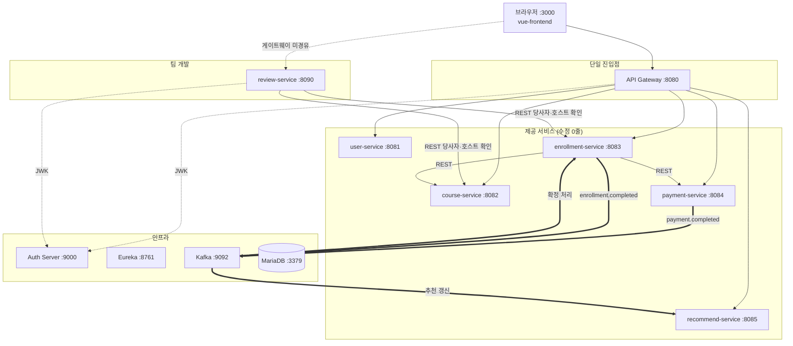

굵은 화살표가 Kafka 를 거치는 비동기 구간이고, 나머지는 동기 REST 호출입니다.
선이 얽히지 않도록 아래 두 가지는 그림에서 생략했습니다.

- **Eureka 등록**: 6개 서비스가 모두 기동 시 자신을 Eureka 에 등록하고 이름으로 서로를 찾습니다.
- **MariaDB 연결**: 6개 서비스가 같은 인스턴스를 쓰며 테이블 단위로만 분리되어 있습니다.
  `review-service` 는 자신이 만든 `reviews` 테이블 하나만 사용합니다.

<!-- 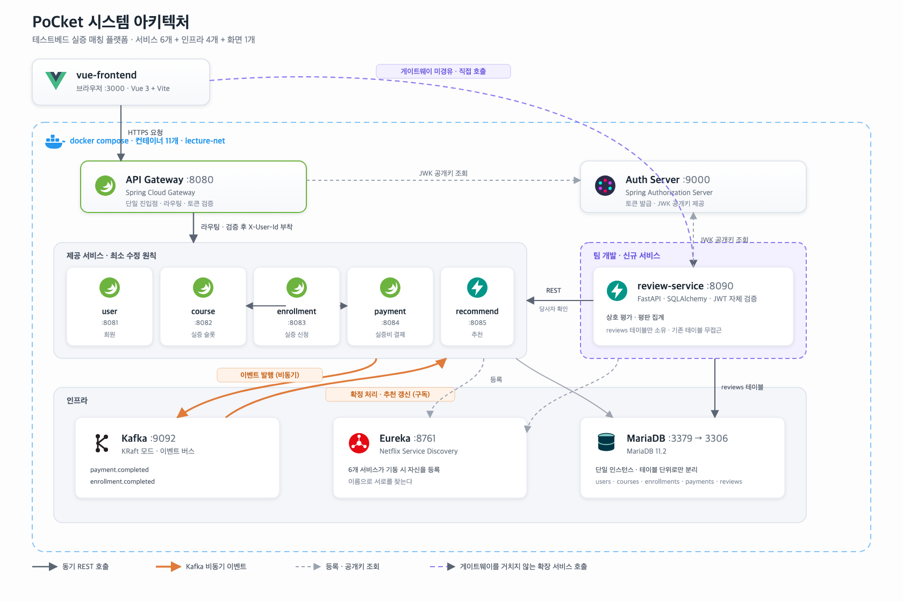 -->

### 유스케이스 다이어그램

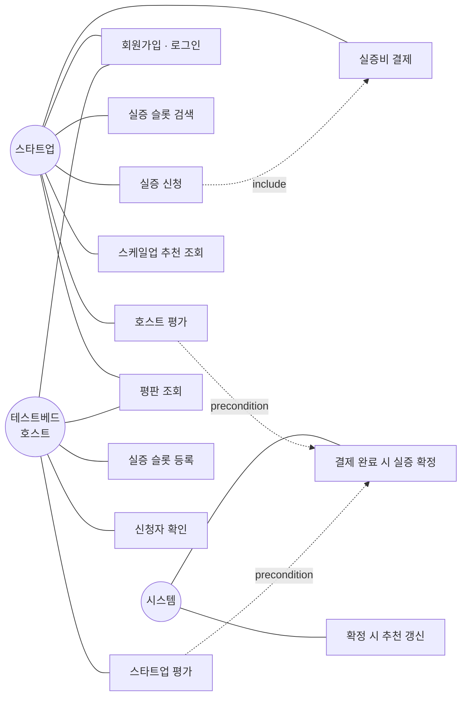

<!--  -->

### 시퀀스 다이어그램 — 실증 신청부터 확정까지

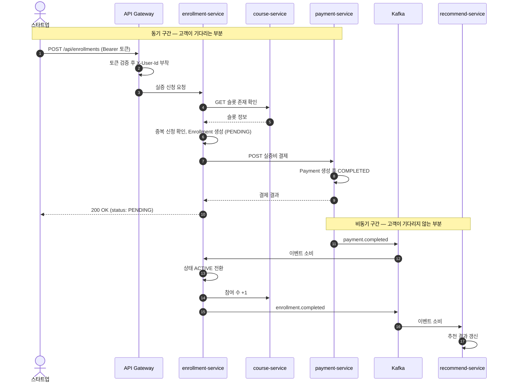

<!--  -->

### 시퀀스 다이어그램 — 상호 평가 등록

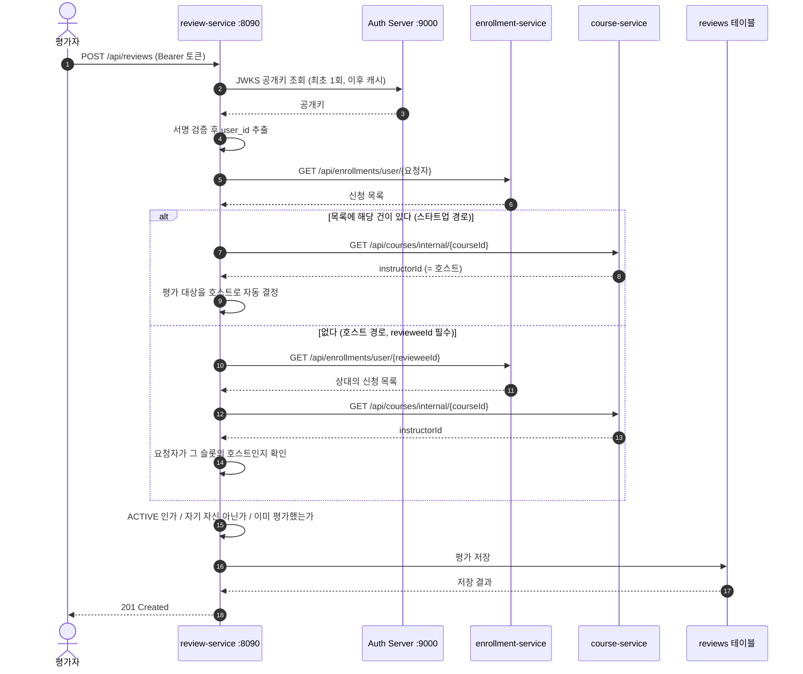

<!--  -->

---

## 빠른 시작

### 1. 이미지 로드

API Gateway와 Auth Server는 소스 없이 이미지로만 배포됩니다. Slack으로 받은 아카이브를 먼저 로드합니다.

```bash
docker load -i infra-images.tar
docker images        # msa-lecture/auth-server:1.0 등 태그 확인
```

이미지 아카이브가 500MB씩 쪼개져 있다면 먼저 합칩니다.

```bash
cat msa-lecture-images.part.* > msa-lecture-images.tar.gz
docker load -i msa-lecture-images.tar.gz
```

### 2. 전체 기동

```bash
docker compose up -d
```

`review-service`는 소스에서 직접 빌드되므로 첫 실행에 시간이 걸립니다.
문제가 생겨 처음부터 다시 만들려면 캐시 없이 빌드합니다.

```bash
docker compose -f docker-compose.build.yml build --no-cache && docker compose up -d
```

### 3. 기동 확인

```bash
docker compose ps                                  # 컨테이너 11개 Up
curl http://localhost:8090/health                  # {"status":"UP",...}
open http://localhost:8761                         # Eureka에 서비스 8개 등록
```

### 4. 더미 데이터와 화면

```bash
docker exec -i lecturedb mariadb -umanager -pSqlDba-1 lecture_db < seed/pocket_seed.sql
cd vue-frontend && npm install && npm run dev
open http://localhost:3000
```

---

## 프론트엔드 실행

`vue-frontend`는 docker-compose에 포함되어 있지 않습니다. 로컬에서 직접 띄웁니다.

```bash
cd vue-frontend
npm install
npm run dev          # http://localhost:3000
```

빌드 확인:

```bash
npm run build
```

Slack으로 받은 zip에서 `node_modules`를 풀었다면 [트러블슈팅](#trouble-quarantine)을 먼저 보세요.

### 계정

Auth Server가 자동 생성하는 계정 두 개로 시작할 수 있습니다.

| 이메일 | 역할 | 용도 |
|---|---|---|
| `student@lecture.com` | STUDENT | 스타트업 (실증 신청) |
| `instructor@lecture.com` | INSTRUCTOR | 호스트 (슬롯 등록) |

시드로 들어가는 호스트 계정 10개(`host.*@pocket.test`)는 카드에 이름을 표시하기 위한 데이터라
로그인할 수 없습니다. 계정이 더 필요하면 회원가입 화면에서 만드세요.

---

## 더미 데이터 적재

화면 개발과 시연용 데이터입니다. **백엔드 코드나 `init-db/`는 건드리지 않고**, 떠 있는 컨테이너에
SQL을 직접 넣는 방식이라 원할 때 넣고 지울 수 있습니다.

```bash
docker exec -i lecturedb mariadb -umanager -pSqlDba-1 lecture_db < seed/pocket_seed.sql
```

| 항목 | 수량 | 비고 |
|---|---|---|
| 실증 슬롯 | 95건 | 산업군 8종 × 약 12건 |
| 호스트 계정 | 10개 | 화면 표시 전용 (로그인 불가) |

모집중/마감 상태가 섞여 있고, 실증 진행 건수는 0~44건, 실증비는 산업군별로 다른 구간에 분포합니다.
목록·필터·추천 정렬을 실제 데이터로 확인하기 위한 구성입니다.

확인:

```bash
docker exec lecturedb mariadb -umanager -pSqlDba-1 lecture_db \
  -e "SELECT category, COUNT(*) FROM courses GROUP BY category;"
```

**`courses`가 비어 있는 상태에서 실행해야 합니다.** 이미 데이터가 있으면 중복 적재됩니다.
초기화하려면 신청 내역을 먼저 지웁니다.

```bash
docker exec lecturedb mariadb -umanager -pSqlDba-1 lecture_db -e "
  DELETE FROM enrollments;
  DELETE FROM courses;
  ALTER TABLE courses AUTO_INCREMENT = 1;
"
```

DB는 `pocket_mariadb_data` 볼륨에 저장되므로 **실행한 사람의 PC에만 반영됩니다.**
팀원이 같은 데이터를 보려면 각자 한 번씩 실행해야 합니다.

자세한 내용은 [`seed/README.md`](seed/README.md)에 있습니다.

---

## 화면 구성

| 경로 | 화면 | 접근 |
|---|---|---|
| `/` | 랜딩 | 공개 |
| `/login` | 로그인 | 비로그인 전용 |
| `/register` | 회원가입 | 비로그인 전용 |
| `/callback` | OAuth2 콜백 | 공개 |
| `/testbeds` | 테스트베드 목록 | 로그인 필요 |
| `/testbeds/new` | 실증 슬롯 등록 | 호스트 전용 |
| `/testbeds/:id` | 슬롯 상세 | 로그인 필요 |
| `/applications` | 내 실증 신청 | 로그인 필요 |
| `/mypage` | 마이페이지 | 로그인 필요 |

라우터 가드가 `requiresAuth` / `guestOnly` / `hostOnly`를 검사합니다.
비로그인 상태로 보호된 경로에 들어가면 로그인 화면으로 돌아갑니다.

---

## 동작 과정

시드 데이터를 넣은 상태에서 아래 순서로 따라가면 전체 흐름을 한 번에 확인할 수 있습니다.
캡처는 [`assets/screenshots/`](assets/screenshots/) 에 있으며, 파일 이름의 번호가 아래 단계와 같습니다.

| # | 단계 | 화면 | 확인할 것 |
|---|---|---|---|
| 1 | 진입 | `/` | 랜딩, 산업군별 카드 |
| 2 | 로그인 | `/login` | `student@lecture.com` 으로 로그인 |
| 3 | 슬롯 탐색 | `/testbeds` | 시드 95건이 산업군 필터로 걸러짐 |
| 4 | 슬롯 상세 | `/testbeds/:id` | 환경 스펙, 기간, 실증비 |
| 5 | 실증 신청 | `/testbeds/:id` | 신청 직후 상태는 `PENDING` |
| 6 | 확정 확인 | `/applications` | 잠시 후 새로고침하면 `ACTIVE` |
| 7 | 상호 평가 | 슬롯 상세 / 마이페이지 | 확정 건에만 평가 가능 |
| 8 | 평판 확인 | `/mypage` | 받은 평가 건수·평균·분포 |

5번과 6번 사이가 이 시스템의 핵심입니다. 응답은 `PENDING` 으로 즉시 돌아오고,
`ACTIVE` 로 바뀌는 것은 Kafka 이벤트를 소비한 뒤입니다. 화면에서 "신청 완료"를 본 직후
새로고침하면 아직 `PENDING` 일 수 있으며, 이것이 최종적 일관성이 사용자에게 드러나는 지점입니다.

<!--
| 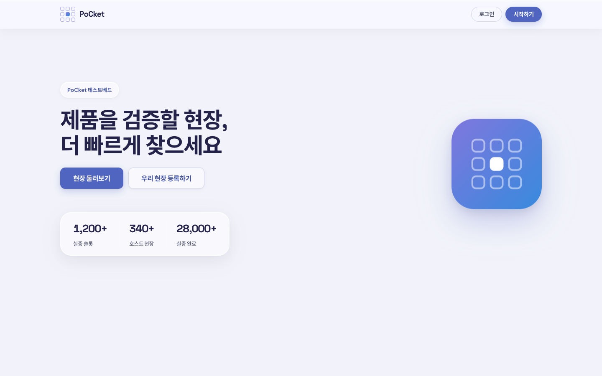 | 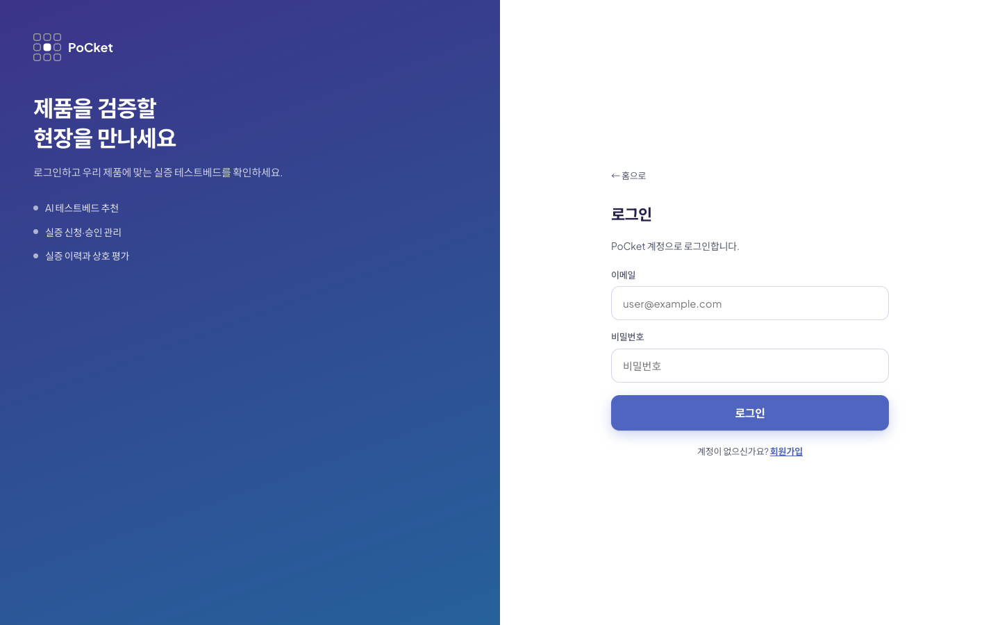 |
|---|---|
| 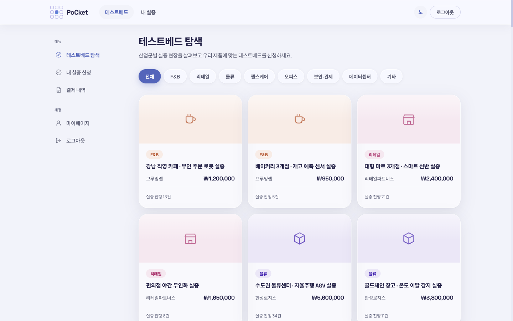 | 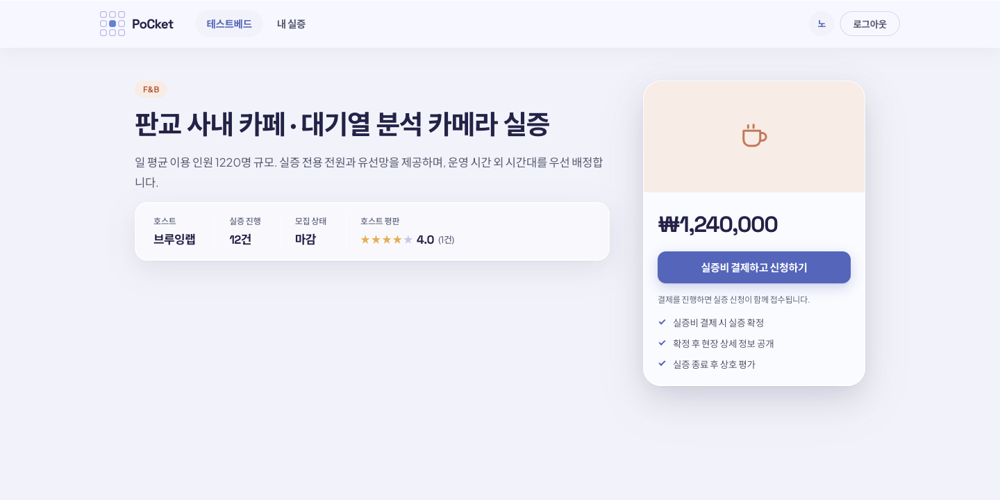 |
| 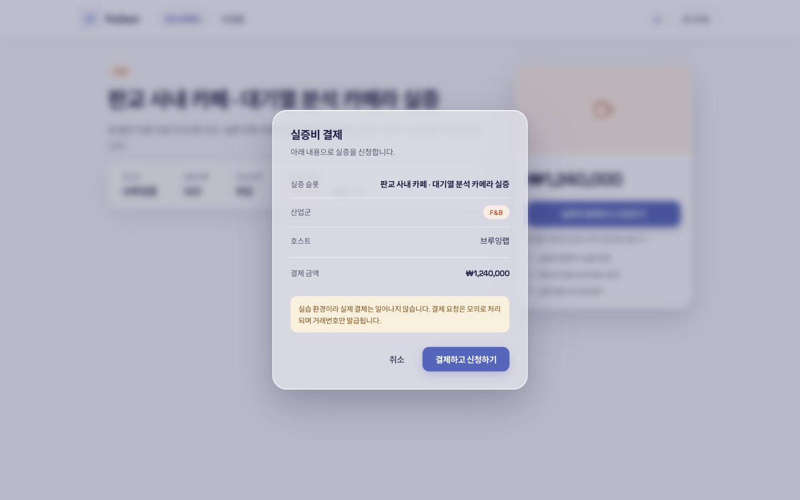 | 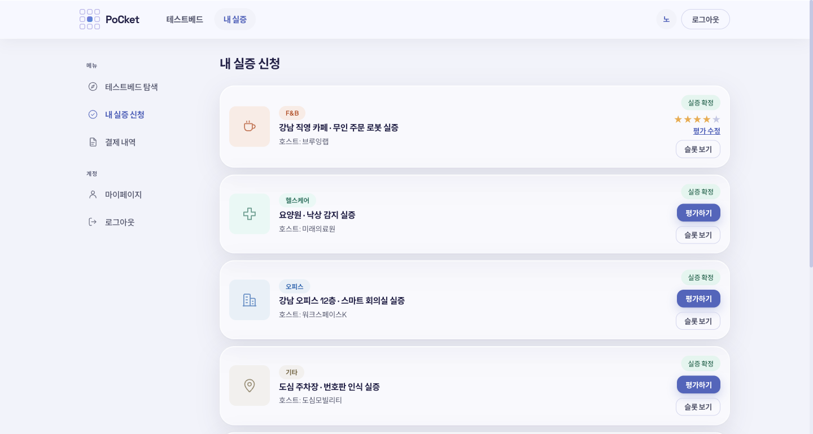 |
| 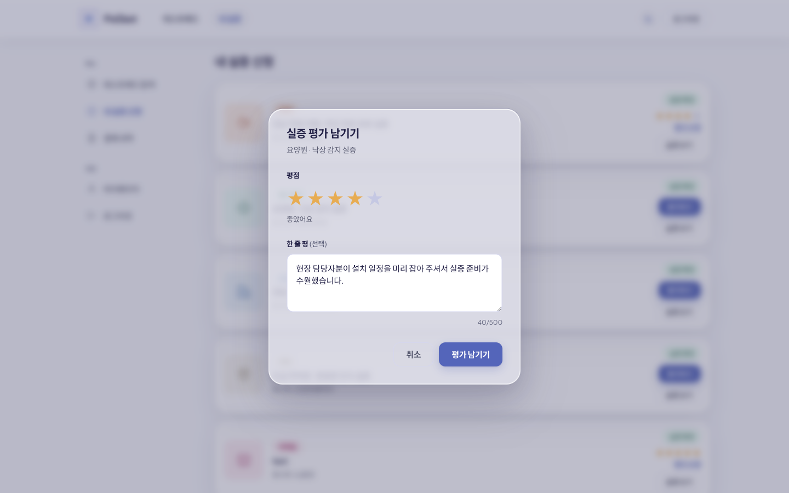 | 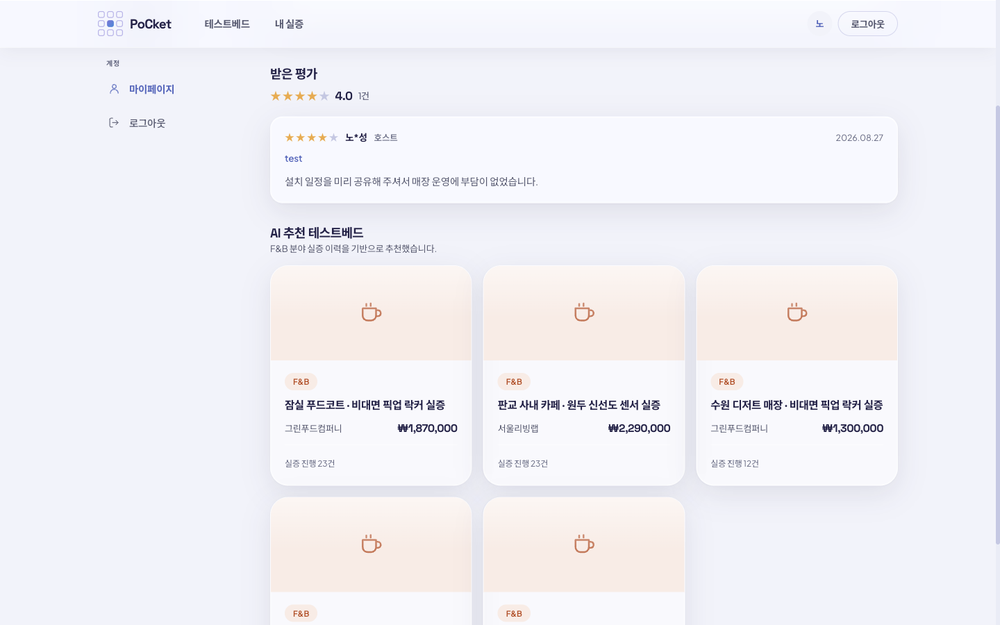 |
-->

캡처 기준과 파일 이름 규칙은 [`assets/README.md`](assets/README.md) 에 정리해두었습니다.

---

## review-service API

호스트와 스타트업이 확정된 실증 건에 대해 서로 평가하고, 그 결과를 다음 매칭의 신뢰 근거로 제공합니다.

| 메서드 | 경로 | 인증 | 설명 |
|---|---|---|---|
| POST | `/api/reviews` | 필요 | 평가 등록 |
| PUT | `/api/reviews/{reviewId}` | 필요 | 본인 평가 수정 |
| DELETE | `/api/reviews/{reviewId}` | 필요 | 본인 평가 삭제 |
| GET | `/api/reviews/me/pending` | 필요 | 아직 남기지 않은 확정 실증 건 |
| GET | `/api/reviews/me/written` | 필요 | 내가 작성한 평가 |
| GET | `/api/reviews/user/{userId}` | 공개 | 받은 평가 목록 |
| GET | `/api/reviews/user/{userId}/reputation` | 공개 | 평판 요약 (건수·평균·분포) |
| GET | `/api/reviews/enrollment/{enrollmentId}` | 공개 | 해당 실증 건의 양방향 평가 |
| GET | `/health` | 공개 | 헬스 체크 |

- Swagger UI: <http://localhost:8090/docs>
- 스펙 내려받기: `curl -s http://localhost:8090/openapi.json -o openapi.json`

400·401·403·404·409·503 응답이 모두 OpenAPI에 기술되어 있어, 코드를 읽지 않고 스펙만으로
API 명세서를 작성할 수 있습니다.

**평가 규칙**

1. 확정(`ACTIVE`)된 실증 건만 평가할 수 있다.
2. 그 실증 건의 당사자만 평가할 수 있다.
3. 한 실증 건당 각자 1회 (`uq_enrollment_reviewer`).
4. 자기 자신은 평가할 수 없다.
5. 평점은 1~5.

당사자 판별은 기존 공개 엔드포인트(`GET /api/enrollments/user/{userId}`,
`GET /api/courses/internal/{courseId}`) 호출만으로 수행합니다. 상세 설계는
[`review-service/README.md`](review-service/README.md)를 보세요.

---

## 개발 규칙

**1. 제공된 백엔드는 수정하지 않는다.**
게이트웨이와 인증 서버는 소스가 없고, 나머지 4개도 이미지 그대로 씁니다. 기능이 필요하면
기존 서비스를 고치는 대신 새 서비스를 옆에 붙이거나 화면에서 우회합니다.

**2. 화면에 보이는 도메인 용어는 `pocket.js`에서만 정의한다.**
[`vue-frontend/src/domain/pocket.js`](vue-frontend/src/domain/pocket.js)가 단일 진실 공급원입니다.
네트워크로는 enum 코드가 오가고, 사람이 읽는 말은 이 파일이 붙입니다.
라벨을 바꾸고 싶으면 이 파일만 고치고, 화면 파일에 문자열을 흩뿌리지 않습니다.

**3. 산업군 enum 대응표를 지킨다.**

| enum (백엔드 고정) | 화면 라벨 |
|---|---|
| `BACKEND` | F&B |
| `FRONTEND` | 리테일 |
| `DEVOPS` | 물류 |
| `DATA_SCIENCE` | 헬스케어 |
| `MOBILE` | 오피스 |
| `SECURITY` | 보안·관제 |
| `DATABASE` | 데이터센터 |
| `OTHER` | 기타 |

여기가 어긋나면 화면에는 "헬스케어"인데 내용은 물류인 슬롯이 생깁니다.
직접 데이터를 넣을 때도 이 표를 기준으로 합니다.

**4. review-service는 자기 테이블만 소유한다.**
`reviews` 테이블 하나만 읽고 씁니다. 다른 서비스의 테이블은 조회하지 않고 REST로 물어봅니다.
FK도 걸지 않습니다.

---

## 운영 명령 모음

```bash
# 전체 로그
docker compose logs -f

# 개별 컨테이너 로그
docker compose logs -f review-service
docker compose logs -f enrollment-service
docker compose logs -f mariadb

# review-service만 다시 빌드해서 올리기 (나머지는 계속 떠 있음)
docker compose -f docker-compose.build.yml build review-service
docker compose up -d review-service

# review-service 로컬 직접 실행 (.env 사용, DB는 compose가 노출한 3379 포트)
cd review-service
pip install -r requirements.txt
uvicorn main:app --reload --port 8090

# DB 접속
docker exec -it lecturedb mariadb -umanager -pSqlDba-1 lecture_db

# 전체 종료
docker compose down

# 볼륨까지 삭제 (스키마를 SQL 파일 기준으로 다시 만들 때)
docker compose down -v
```

### 확인용 주소

| 주소 | 용도 |
|---|---|
| <http://localhost:3000> | PoCket 화면 |
| <http://localhost:8090/docs> | review-service Swagger UI |
| <http://localhost:8761> | Eureka 대시보드 |
| <http://localhost:8080> | API Gateway |

---

## 트러블슈팅

<a id="trouble-quarantine"></a>

### npm run dev / build 가 네이티브 바이너리 오류로 실패한다

```
Error: Cannot find native binding.
dlopen(.../rolldown-binding.darwin-arm64.node): library load disallowed by system policy
```

Slack으로 받은 zip에서 푼 `node_modules`라 macOS가 네이티브 바이너리에 검역 딱지를 붙인 것입니다.
`npm install`을 다시 할 필요 없이 속성만 제거하면 됩니다.

```bash
cd vue-frontend
xattr -dr com.apple.quarantine node_modules
```

### 게이트웨이(8080)로 조회했는데 401이 온다

게이트웨이의 공개 경로 목록에는 `/users/register`, `/users/login`, `/oauth2/**`만 등록되어 있습니다.
그 외 경로는 토큰이 필요합니다. 서비스에 직접(8082 등) 호출하면 200이 오더라도, 게이트웨이가
먼저 막으므로 화면에서는 로그인이 필요합니다.

### 화면에 아무것도 안 나온다

컨테이너가 다 떠 있어도 데이터가 없으면 목록은 비어 있습니다.
[더미 데이터 적재](#더미-데이터-적재)를 먼저 실행하세요.

### 인텔 맥/윈도우에서 제공 이미지가 느리다

제공 서비스는 `platform: linux/arm64`로 고정되어 있습니다. 애플 실리콘 기준으로 만들어진
이미지라 다른 아키텍처에서는 에뮬레이션됩니다. `review-service`는 소스에서 빌드하므로
platform을 고정하지 않았고, 각자 환경에 맞춰 빌드됩니다.

### review-service가 DB 커넥션에서 TypeError를 낸다

aiomysql 어댑터의 `ping()` 시그니처가 SQLAlchemy의 pre-ping 호출과 맞지 않습니다.
`pool_pre_ping`은 끄고 `pool_recycle=1800`으로 커넥션을 재활용합니다. 이 설정을 되돌리지 마세요.

### 실증 신청 목록에 산업군이 '미분류', 호스트가 '호스트 미상'으로 뜬다

enrollment-service가 응답 전에 enum을 한글로 바꾸고(`BACKEND` → `백엔드`) `instructorName`을
null로 주기 때문입니다. 백엔드를 고칠 수 없으므로 프론트에서 슬롯 원본을 `courseId`로 한 번씩
조회해 채웁니다. 이미 반영되어 있습니다.

---

## 알려진 제약

- **결제 직후 잠깐은 아직 확정이 아니다.** 응답에는 `PENDING`이 담기고 `ACTIVE`로 바뀌는 것은
  Kafka 이벤트를 소비한 뒤입니다. 최종적 일관성이 사용자에게 드러나는 지점입니다.
- **호스트 승인 단계가 실제로는 없다.** 템플릿의 상태값이 `PENDING`/`ACTIVE` 둘뿐이라
  승인은 화면상의 표현으로만 처리합니다.
- **호스트 입장의 미평가 목록이 없다.** `me/pending`은 스타트업 입장만 돌려줍니다.
  "슬롯별 신청자 조회" 엔드포인트가 기존 백엔드에 없기 때문이며, 화면에서는 슬롯 상세의
  신청자 목록을 통해 평가하는 흐름으로 처리합니다.
- **실증비가 고정값이다.** `EnrollmentService.enroll()`이 결제 금액을 상수로 넘깁니다.
- **DB가 물리적으로 분리되어 있지 않다.** `reviews`는 새 테이블이지만 같은 MariaDB 인스턴스 안에 있습니다.
- **`reviews` 테이블 생성 경로가 둘이다.** 기동 시 `create_all`로도, `init-db/02_review_init.sql`로도
  만들어집니다. `CHECK` 제약과 `ON UPDATE CURRENT_TIMESTAMP`는 SQL 파일에만 있으므로,
  볼륨을 새로 만들어 SQL 파일로 생성하는 쪽을 권장합니다.
- **랜딩의 인기 테스트베드 6장은 하드코딩된 샘플이다.** 실제 데이터는 로그인 후 `/testbeds`에서 보입니다.

---

## 브랜치와 문서

| 브랜치 | 내용 |
|---|---|
| `main` | 통합 브랜치. 두 feature 브랜치를 병합해 유지합니다. |
| `feature/review-service` | 상호 평가 서비스 (백엔드) |
| `feature/frontend-pocket-remap` | 도메인 리매핑, 디자인 시스템, 시드 (프론트엔드) |

| 문서 | 내용 |
|---|---|
| [`review-service/README.md`](review-service/README.md) | 평가 서비스 설계, 당사자 판별, API 상세 |
| [`seed/README.md`](seed/README.md) | 더미 데이터 구성과 초기화 방법 |
| `docs/` | 내부 기획·설계 문서 (`.gitignore`로 GitHub 미공개) |

이미지 아카이브(`*.tar`, `*.tar.gz`, `msa-lecture-images.part.*`)와 `node_modules/`,
`docs/`는 저장소에 올리지 않습니다. 이미지는 코드가 아니라 빌드 산출물이므로 Slack으로 배포합니다.
